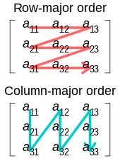

### Transpose Matrix
Used to convert a matrix between row-major order & column-major order.



```csharp
public double[] TransposeMatrix(double[] inputMatrix, int width = 4, int height = 4)
{
	double[] result = new double[width * height];

	for (int i = 0; i < height; i++)
	{
		for (int j = 0; j < width; j++)
		{
			double currentValue = inputMatrix[i + (j * width)];
			currentValue = Math.Round(currentValue, 3);
			result[(i * width) + j] = currentValue;
		}
	}

	return result;
}
```

```csharp
public double[,] TransposeMatrix(double[,] inputMatrix, int width = 4, int height = 4)
{
    double[,] result = new double[width, height];

    for (int i = 0; i < height; i++)
    {
        for (int j = 0; j < width; j++)
        {
            result[j, i] = inputMatrix[i, j];
        }
    }

    return result;
}
```
